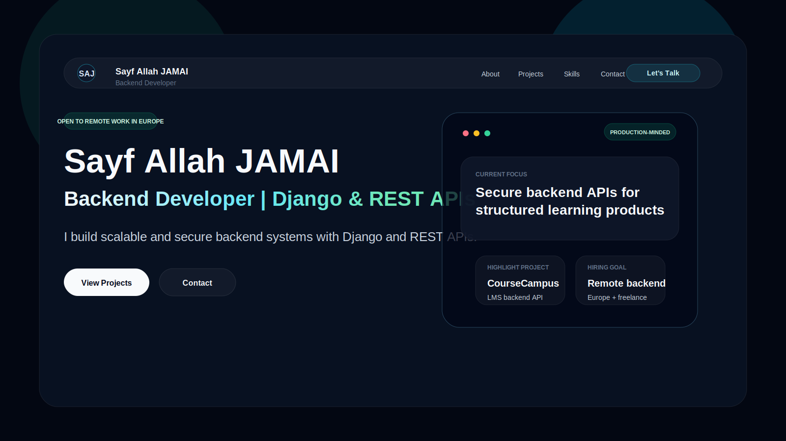

# Sayf Allah JAMAI Portfolio

A professional backend developer portfolio built with React, Vite, and Tailwind CSS to showcase Django, Django REST Framework, JWT authentication, and API-focused backend work.

## Project Description

This portfolio presents Sayf Allah JAMAI as a backend developer with a cybersecurity background, focused on building secure, scalable backend systems for modern web products. The project is designed as a polished, recruiter-friendly portfolio with a dark premium interface, clear technical positioning, and a strong featured project section.

## Featured Project

### CourseCampus - LMS Backend API

CourseCampus is the main featured project in this portfolio. It is a backend-first Learning Management System API built to solve the need for secure authentication, role-based access, structured course management, student enrollment flows, lesson protection, and assignment handling.

Built with Django and Django REST Framework, it demonstrates:

- JWT authentication
- Custom user roles for Student, Instructor, and Admin
- Role-based permissions
- Course creation and management
- Student enrollment workflows
- Lesson access control
- Assignment submission handling
- API-only backend architecture

Repository:

- https://github.com/sniipe-er/CourseCampus

## Features

- Modern dark portfolio interface with responsive layout
- Hero, About, Projects, Skills, Contact, and Footer sections
- Featured backend project spotlight
- Clear presentation of backend skills and stack
- Sticky navigation with smooth scrolling
- Contact form UI using `mailto:`
- Custom favicon and social preview assets

## Tech Stack

- React
- Vite
- Tailwind CSS
- JavaScript

## Setup

### 1. Clone the repository

```bash
git clone https://github.com/sniipe-er/Portfolio.git
cd Portfolio
```

### 2. Install dependencies

```bash
npm install
```

### 3. Start the development server

```bash
npm run dev
```

### 4. Build for production

```bash
npm run build
```

### 5. Preview the production build

```bash
npm run preview
```

## Live Demo

- Live demo: Add your deployed portfolio URL here

## Screenshots

- Add homepage screenshot here
- Add projects section screenshot here
- Add mobile screenshot here


